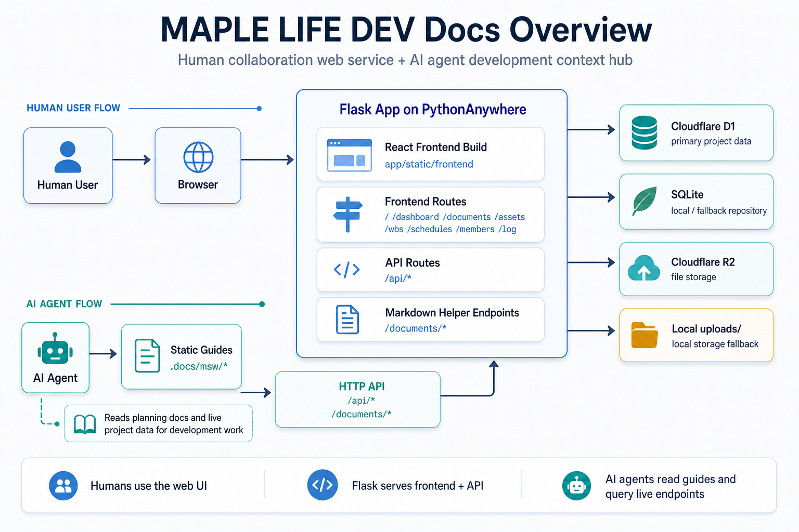

# MAPLE LIFE DEV Docs

`MAPLE LIFE DEV Docs`는 메이플스토리 월드 개발팀이 문서, WBS, 일정, 멤버, Assets를 한 곳에서 관리하기 위한 내부 협업용 웹앱입니다.

이 서비스는 사용자가 브라우저에서 직접 사용하는 협업 도구이면서, 동시에 AI Agent가 기획 문서와 운영 데이터를 확인하며 개발 작업을 진행할 때 참조하는 작업 허브 역할도 합니다.

현재 운영 기준은 `Flask + React(MUI)` 프론트, `Cloudflare D1 / SQLite` 데이터 저장소, `Cloudflare R2 / 로컬 uploads` 파일 스토리지 조합입니다.



## 현재 운영 구조

```text
User
  -> Browser
      -> Flask (PythonAnywhere)
          -> React build (app/static/frontend)
          -> Frontend routes (/ /dashboard /documents /assets /wbs /schedules /members /log)
          -> API (/api/*)
          -> Markdown utility endpoints (/documents/*)
          -> D1 or SQLite
          -> R2 or local uploads

AI Agent
  -> Static guides (.docs/msw/*)
  -> HTTP API (/api/*, /documents/*)
      -> Flask (PythonAnywhere)
          -> D1-backed documents / project data
          -> Markdown helper endpoints
```

이 구조를 쓰는 이유는 아래와 같습니다.

- 프론트는 React로 분리해 화면 리팩토링과 UI 유지보수를 쉽게 가져갑니다.
- Flask는 API, 업로드, Markdown 유틸, 배포 진입점 역할에 집중합니다.
- PythonAnywhere에서는 React 빌드 결과만 서빙하면 되므로 운영이 단순합니다.
- 데이터와 스토리지를 D1/R2로 분리해 이후 Cloudflare 중심 구조로 확장하기 쉽습니다.
- AI Agent는 `.docs/msw/` 가이드와 운영 API를 함께 참조해, 최신 기획 문맥과 구현 대상 데이터를 확인하며 작업할 수 있습니다.

## 사용자와 AI Agent의 역할

- 사용자는 브라우저에서 대시보드, 문서, WBS, 일정, 멤버, 에셋 관리 화면을 직접 사용합니다.
- Flask 앱은 React 프론트엔드와 API를 함께 서빙하며, 문서 미리보기/업로드 같은 보조 엔드포인트도 제공합니다.
- AI Agent는 `.docs/msw/`의 정적 가이드를 먼저 읽고, 필요하면 운영 API를 조회해 최신 문서와 데이터를 다시 확인합니다.
- 즉, 이 서비스는 단순한 내부 웹앱이 아니라, 사용자와 AI가 같은 문서/데이터 기반 위에서 협업하는 개발 허브로 동작합니다.

## 주요 기능

- 대시보드
  - 진행 현황
  - 이번 주 마감 작업
  - 최근 문서 / 최근 WBS 업데이트 / 예정 일정 / 공지 확인
- 문서
  - 생성 / 수정 / 삭제 / 상세 보기
  - 폴더 / 태그 / 숨김 문서 관리
  - 관련 WBS 연결
  - Markdown 렌더링
  - 이미지 업로드 및 문서 자산 연결
- Assets
  - Assets 목록 / 상세 / 등록 / 수정 / 삭제
  - 그룹(폴더) 트리 관리
  - 태그 / 상태 / 유형 / 등록자 관리
  - Cloudflare R2 또는 로컬 파일 연동
- WBS
  - 작업 생성 / 수정 / 삭제
  - 상위 / 하위 작업 구조
  - 담당자 / 상태 / 우선순위 / 진행률 / 완료일 관리
  - 문서 연결
- 일정
  - 일정 생성 / 수정 / 삭제
  - 일정 유형 / 담당자 / 연결 작업 관리
- 멤버
  - 멤버 생성 / 수정 / 삭제
  - 작업 / 일정 / 문서 작성자 참조 관리
- 로그
  - `/log` 경로에서 페이지 접속 로그 조회

## 주요 경로

- `/`
- `/dashboard`
- `/documents`
- `/assets`
- `/wbs`
- `/schedules`
- `/members`
- `/log`

레거시 경로는 현재 아래처럼 리다이렉트됩니다.

- `/app/*`
- `/document/*`
- `/asset/*`
- `/task/*`
- `/schedule/*`
- `/member/*`
- `/logs`

## 기술 스택

- Frontend: `React`, `React Router`, `MUI`, `Vite`
- Backend: `Flask`
- Database:
  - `SQLite` 로컬 개발/보조 저장
  - `Cloudflare D1` 운영 데이터 저장소
- Storage:
  - `Cloudflare R2`
  - 또는 로컬 `uploads/`
- Infra / Deploy:
  - `PythonAnywhere`
  - `Cloudflare Wrangler` 관련 설정 파일 유지

## 디렉터리 개요

```text
maple-life-docs/
├─ app/
│  ├─ __init__.py              # Flask app factory / config
│  ├─ api.py                   # React frontend용 API
│  ├─ frontend.py              # React build 서빙 및 라우팅
│  ├─ documents.py             # Markdown 유틸 / 업로드 관련 엔드포인트
│  ├─ db.py                    # SQLite schema / migration helper
│  ├─ storage.py               # local / R2 파일 저장소 처리
│  ├─ repositories/            # sqlite / d1 repository provider 레이어
│  └─ static/frontend/         # Vite build 결과물
├─ frontend/
│  ├─ src/
│  └─ package.json
├─ database/d1/
│  ├─ README.md
│  └─ schema.sql
├─ scripts/
├─ deployment/
├─ .docs/                      # 개발용 내부 문서 / 회고 / 마일스톤
├─ uploads/
├─ instance/                   # 로컬 SQLite DB / page view 로그 등 런타임 파일
├─ worker/                     # Cloudflare Worker(JS) 관련 실험/보조 배포 코드
├─ worker-python/              # Cloudflare Python Worker 관련 설정/코드
├─ run.py
├─ requirements.txt
├─ package.json
├─ wrangler.toml
├─ wrangler.toml.example
└─ .env.example
```

## 데이터 / 저장소 백엔드

데이터 접근은 `repository provider` 구조로 분리되어 있습니다.

- `REPOSITORY_BACKEND=sqlite`
  - 로컬 SQLite 사용
- `REPOSITORY_BACKEND=d1`
  - Cloudflare D1 REST API 사용

스토리지는 아래처럼 분기됩니다.

- `STORAGE_BACKEND=local`
  - `uploads/` 사용
- `STORAGE_BACKEND=r2`
  - Cloudflare R2 사용

## 스키마 기준

로컬 SQLite와 D1은 DB 파일 자체보다 아래 스키마 정의를 기준으로 관리합니다.

- 로컬 SQLite 앱 스키마/초기화/마이그레이션:
  - [app/db.py](app/db.py)
  - `SCHEMA_SQL`과 `init_db()`, `migrate_legacy_schema()`가 로컬 `app.db` 구조를 정의합니다.
- Cloudflare D1 baseline 스키마:
  - [database/d1/schema.sql](database/d1/schema.sql)
  - Wrangler/D1 반영 시 기준이 되는 정식 SQL 스키마입니다.

즉, `instance/app.db` 같은 런타임 SQLite 파일은 생성 결과물이고, 구조의 정식 기준은 위 두 파일입니다.

## 빠른 시작

### 1. Python 의존성 설치

```bash
pip install -r requirements.txt
```

### 2. 프론트 의존성 설치

```bash
npm run frontend:install
```

### 3. 환경 변수 준비

`.env.example`을 기준으로 `.env`를 작성합니다.

주의:

- `.env.example`의 `DATABASE={}` / `UPLOAD_FOLDER={}`는 "비워둔 자리" 표시입니다.
- 로컬 기본 경로를 그대로 쓰려면 해당 줄을 삭제하거나, 실제 경로로 명시해서 사용하세요.
- 값을 비우지 않고 `{}` 그대로 두면 문자열 `"{}"` 경로를 사용하게 됩니다.

최소 예시:

```env
SECRET_KEY=dev
REPOSITORY_BACKEND=sqlite
STORAGE_BACKEND=local
DISPLAY_TIMEZONE=Asia/Seoul
```

Cloudflare 연동 시 주요 값:

- `CLOUDFLARE_ACCOUNT_ID`
- `D1_DATABASE_ID`
- `CLOUDFLARE_API_TOKEN`
- `R2_BUCKET_NAME`
- `R2_ACCOUNT_ID`
- `R2_ACCESS_KEY_ID`
- `R2_SECRET_ACCESS_KEY`
- `R2_PUBLIC_BASE_URL`

### 4. 프론트 빌드

```bash
npm run frontend:build
```

### 5. 로컬 DB 초기화

로컬 SQLite는 앱이 처음 뜰 때 자동 생성되지만, 명시적으로 초기화하거나 샘플 데이터를 넣고 시작하려면 아래 명령을 사용합니다.

스키마만 초기화:

```bash
flask --app run.py init-db
```

샘플 협업 데이터 주입:

```bash
flask --app run.py seed-sample-data
```

이미 데이터가 있는데 샘플 데이터를 다시 채우려면:

```bash
flask --app run.py seed-sample-data --force
```

정리:

- `init-db`는 테이블/컬럼 등 스키마만 준비합니다.
- `seed-sample-data`는 멤버, WBS, 문서, 일정, 공지 샘플 데이터를 넣습니다.
- `instance/app.db`는 런타임 생성물이라 레포에 포함하지 않아도 됩니다.

### 6. 로컬 실행

```bash
python run.py
```

기본 로컬 주소:

- `http://localhost:5000`

## 프론트 개발

개발 중에는 Vite 개발 서버를 따로 띄울 수 있습니다.

```bash
npm run frontend:dev
```

최종 반영은 항상 아래 빌드 결과 기준입니다.

```bash
npm run frontend:build
```

빌드 결과물은 `app/static/frontend/`에 생성됩니다.

## 운영 / 점검 명령

Cloudflare 연결 상태를 빠르게 확인하려면 아래 명령을 사용합니다.

```bash
flask cloudflare-check
```

예시:

```bash
FLASK_APP=run.py flask cloudflare-check
```

PowerShell 예시:

```powershell
$env:FLASK_APP="run.py"
flask cloudflare-check
```

이 명령은 아래를 확인합니다.

- 현재 repository backend
- 현재 storage backend
- dashboard summary 조회 가능 여부
- active members 조회 가능 여부
- R2 public base URL 설정 여부

## 실행 엔트리포인트

현재 저장소에는 두 가지 앱 진입점이 있습니다.

- `asgi.py`
  - FastAPI 운영/이관 대상 엔트리포인트
- `run.py`
  - 기존 Flask 호환 엔트리포인트

로컬에서 FastAPI를 실행하려면 아래처럼 사용합니다.

```bash
uvicorn asgi:app --reload
```

간단한 래퍼 스크립트를 쓰고 싶다면 아래도 가능합니다.

```bash
python fastapi_run.py
```

## PythonAnywhere 배포

현재 문서 기준 운영 구성은 PythonAnywhere의 Flask 기준 설명을 유지하고 있습니다.

다만 코드베이스는 FastAPI 이관을 진행 중이므로, 앞으로 운영 전환 시에는 `run.py` 대신 `asgi.py`를 기준으로 ASGI 서버 구성을 잡는 방향이 자연스럽습니다.

ASGI 서버 예시는 [deployment/asgi_uvicorn.example.txt](/D:/dev/git/maple-life-docs/deployment/asgi_uvicorn.example.txt)에 정리해두었습니다.

일반적인 반영 순서는 아래와 같습니다.

1. 로컬에서 React 빌드
2. 빌드 결과 포함하여 커밋 / 푸시
3. PythonAnywhere에서 `git pull`
4. 필요 시 스크립트 실행
5. 웹 앱 reload

빠른 반영용 스크립트:

```bash
bash scripts/pythonanywhere_refresh.sh
```

virtualenv 이름이 다르면 아래처럼 지정할 수 있습니다.

```bash
VENV_NAME=<your_virtualenv_name> bash scripts/pythonanywhere_refresh.sh
```

## 현재 참고 사항

- 시간 표시는 프론트에서 `Asia/Seoul` 기준으로 변환해 보여줍니다.
- React 빌드 청크는 배포 시 파일명이 바뀌므로, 빌드 후에는 최신 정적 파일 기준으로 반영해야 합니다.
- `instance/app.db`는 로컬/보조용 SQLite이며, 운영 데이터 기준은 D1을 우선으로 봅니다.
