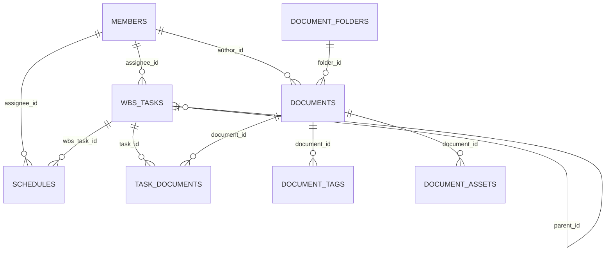

# MAPLE LIFE DEV Docs

`MAPLE LIFE DEV Docs`는 메이플라이프 DEV 팀의 문서, WBS, 일정, 멤버 정보를 한 곳에서 관리하기 위한 내부 협업용 웹앱입니다.

현재 서비스 코어는 `Flask + Jinja2` 기반으로 동작하고 있으며, 저장소/배포 구조는 아래 방향으로 Cloudflare 이관을 진행 중입니다.

- 앱 구조: Flask SSR
- 운영 DB 목표: Cloudflare D1
- 이미지 스토리지 목표: Cloudflare R2
- 배포 런타임 상태: Worker bootstrap 준비 완료, 전체 Flask 런타임 이관은 진행 중

## 현재 상태

- 문서, WBS, 일정, 멤버 관리 기능은 Flask 앱에서 동작합니다.
- Markdown 문서 이미지 업로드는 R2 연동 기준으로 구현되어 있습니다.
- 데이터 접근은 `repository provider` 구조로 분리되어 있습니다.
- `REPOSITORY_BACKEND=sqlite` 또는 `REPOSITORY_BACKEND=d1` 전환이 가능합니다.
- D1 REST 기반 read/write는 주요 도메인에 대해 검증이 끝난 상태입니다.
- Cloudflare Worker는 현재 bootstrap 상태이며, 기존 Flask 앱 전체를 Worker 런타임으로 옮기는 단계가 남아 있습니다.

## 주요 기능

- 대시보드
  - 작업 진행 현황
  - 이번 주 마감 작업
  - 최근 문서 / 최근 작업 / 예정 일정
- WBS
  - 작업 생성 / 수정 / 삭제
  - 상위/하위 작업 구조
  - 담당자 / 상태 / 우선순위 / 진행률 관리
  - 문서 연결
- 문서
  - 문서 생성 / 수정 / 삭제 / 상세 보기
  - 폴더 / 태그 / 관련 작업 연결
  - Markdown 렌더링
  - 이미지 업로드 및 문서별 자산 관리
- 일정
  - 일정 생성 / 수정 / 삭제
  - 담당자 / 연결 작업 관리
- 멤버
  - 멤버 생성 / 수정 / 삭제
  - 작업 / 일정 / 문서 작성자 참조 관리

## 기술 스택

- Backend: `Flask`
- Template: `Jinja2`
- Database:
  - 현재 로컬/기존 실행: `SQLite`
  - 이관 대상: `Cloudflare D1`
- Storage:
  - 로컬 fallback: `uploads/`
  - 이관 대상: `Cloudflare R2`
- Infra/Deploy:
  - 기존 운영 이력: `PythonAnywhere`
  - 현재 준비 중: `Cloudflare Workers + D1 + R2`

## 빠른 실행

### 1. 의존성 설치

```bash
pip install -r requirements.txt
```

### 2. 환경 변수 준비

`.env.example`를 참고해서 `.env`를 구성합니다.

주요 변수:

- `SECRET_KEY`
- `DATABASE`
- `REPOSITORY_BACKEND`
- `STORAGE_BACKEND`
- `R2_BUCKET_NAME`
- `R2_ACCOUNT_ID`
- `R2_ACCESS_KEY_ID`
- `R2_SECRET_ACCESS_KEY`
- `R2_PUBLIC_BASE_URL`
- `CLOUDFLARE_ACCOUNT_ID`
- `D1_DATABASE_ID`
- `CLOUDFLARE_API_TOKEN`

### 3. 앱 실행

```bash
python run.py
```

## Cloudflare 관련 실행 메모

### Wrangler

프로젝트에는 Worker bootstrap과 Wrangler 설정이 포함되어 있습니다.

```bash
npm install
npm run cf:deploy:dry
```

현재 확인된 상태:

- `wrangler deploy --dry-run` 통과
- D1 binding: `DB`
- R2 binding: `DOCUMENT_IMAGES`

주의:

- 현재 [worker/index.js](/D:/dev/git/maple-life-docs/worker/index.js)는 bootstrap Worker입니다.
- Flask 앱 전체가 Worker 런타임에서 그대로 실행되는 상태는 아직 아닙니다.

## 디렉터리 Overview

```text
maple-life-docs/
├─ app/
│  ├─ __init__.py              # Flask app factory / config
│  ├─ dashboard.py             # 대시보드 라우트
│  ├─ documents.py             # 문서 라우트
│  ├─ wbs.py                   # WBS 라우트
│  ├─ schedules.py             # 일정 라우트
│  ├─ members.py               # 멤버 라우트
│  ├─ storage.py               # local / R2 스토리지 처리
│  ├─ db.py                    # SQLite schema / helper / local migration
│  ├─ utils.py                 # 공통 유틸
│  ├─ constants.py             # 상태값 / 선택값 상수
│  ├─ repositories/            # repository/provider/backend 계층
│  ├─ static/                  # CSS / JS
│  └─ templates/               # Jinja 템플릿
├─ database/
│  └─ d1/
│     ├─ README.md             # D1 기준 문서
│     ├─ schema.sql            # D1 baseline schema
│     └─ export_sqlite_to_d1.py
├─ worker/
│  └─ index.js                 # Cloudflare Worker bootstrap
├─ .docs/
│  └─ cloudflare/              # Cloudflare 이관 작업 로그 / changelog / reference
├─ run.py                      # 로컬 실행 엔트리
├─ requirements.txt            # Python 의존성
├─ package.json                # Wrangler 실행 스크립트
├─ wrangler.toml.example       # 공유용 Wrangler 예시
└─ cloudflare-migration-task.md
```

## 코드베이스 구조 설명

### 1. Flask 라우트 계층

아래 파일들이 실제 화면/기능 단위 라우트를 담당합니다.

- [app/dashboard.py](/D:/dev/git/maple-life-docs/app/dashboard.py)
- [app/documents.py](/D:/dev/git/maple-life-docs/app/documents.py)
- [app/wbs.py](/D:/dev/git/maple-life-docs/app/wbs.py)
- [app/schedules.py](/D:/dev/git/maple-life-docs/app/schedules.py)
- [app/members.py](/D:/dev/git/maple-life-docs/app/members.py)

### 2. Repository Provider 계층

직접 SQL을 라우트에 박아두는 구조를 줄이기 위해 `provider + backend` 구조를 두고 있습니다.

핵심 파일:

- [app/repositories/provider.py](/D:/dev/git/maple-life-docs/app/repositories/provider.py)
- [app/repositories/contracts.py](/D:/dev/git/maple-life-docs/app/repositories/contracts.py)
- [app/repositories/sqlite_backend.py](/D:/dev/git/maple-life-docs/app/repositories/sqlite_backend.py)
- [app/repositories/d1_backend.py](/D:/dev/git/maple-life-docs/app/repositories/d1_backend.py)

동작 방식:

- `REPOSITORY_BACKEND=sqlite`
  - SQLite query 구현을 사용
- `REPOSITORY_BACKEND=d1`
  - Cloudflare D1 REST API 구현을 사용

즉, 라우트는 가능하면 “DB 종류”를 몰라도 되게 만들고, backend에서 SQLite/D1 차이를 흡수하는 방향입니다.

### 3. 스토리지 계층

[app/storage.py](/D:/dev/git/maple-life-docs/app/storage.py)에서 이미지 업로드 대상을 분기합니다.

- `STORAGE_BACKEND=local`
  - `uploads/` 사용
- `STORAGE_BACKEND=r2`
  - Cloudflare R2 사용

### 4. SQLite 보조 역할

현재 D1 backend는 주요 데이터 write를 D1에 반영하면서도 일부 로컬 호환성을 위해 shadow SQLite sync를 유지합니다.

이유:

- 기존 Flask 코드와의 점진적 호환
- 로컬 테스트 편의성
- 전체 Worker 런타임 이전 전 과도기 안정성 확보

## 데이터베이스 개요

주요 테이블:

- `members`
- `wbs_tasks`
- `documents`
- `document_folders`
- `document_tags`
- `document_assets`
- `task_documents`
- `schedules`
- `notices`
- `assets`

상세 내용은 [database/d1/README.md](/D:/dev/git/maple-life-docs/database/d1/README.md)를 참고하면 됩니다.

## DB 스키마 ERD



## 참고 문서

- [database/d1/README.md](/D:/dev/git/maple-life-docs/database/d1/README.md)

## 현재 기준 한 줄 정리

이 프로젝트는 “Flask 기반 내부 협업 도구”를 유지하면서, 데이터와 스토리지를 Cloudflare D1/R2 중심으로 점진 이관하는 중간 단계에 있습니다.
