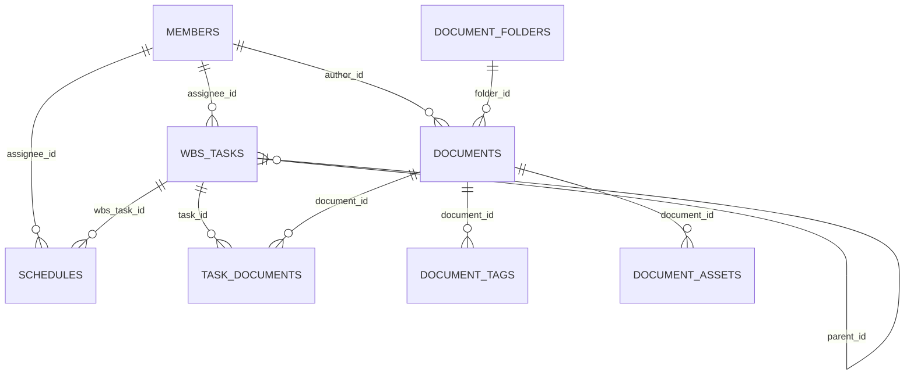

# Cloudflare D1 데이터베이스 가이드

이 디렉터리는 `MAPLE LIFE DEV Docs` 프로젝트를 Cloudflare D1 기준으로 운영하기 위한 데이터베이스 기준 문서를 담고 있습니다.

현재 프로젝트는 원래 `SQLite` 중심으로 시작했지만, Cloudflare 이관을 위해 D1 기준 schema와 export 흐름을 별도로 관리하고 있습니다.

## 이 디렉터리의 목적

- Cloudflare D1에서 사용할 baseline schema를 관리
- 기존 SQLite 운영 데이터를 D1으로 옮기기 위한 기준 제공
- 앞으로 `wrangler d1 execute` 또는 D1 migration 작업의 출발점 역할 수행
- 테이블 구조와 관계를 문서화

## 포함 파일

### `schema.sql`

Cloudflare D1 기준의 baseline schema입니다.

포함 내용:

- 테이블 생성문
- 외래키 관계
- 기본값
- 주요 조회 성능을 위한 인덱스

이 파일은 “현재 운영 구조를 D1에서 재현하기 위한 기준 스키마”로 보면 됩니다.

### `export_sqlite_to_d1.py`

기존 SQLite 데이터를 D1에서 실행 가능한 `INSERT` SQL 형태로 내보내기 위한 스크립트입니다.

용도:

- `instance/app.db` 같은 SQLite 파일을 읽음
- 각 테이블 데이터를 D1 호환 SQL로 export
- 원격 D1 반영 전 사전 데이터 준비

## 현재 전제

이 프로젝트는 아래 흐름을 기준으로 관리합니다.

1. SQLite 운영/테스트 구조 정리
2. `schema.sql` 기준으로 D1 baseline 구성
3. `export_sqlite_to_d1.py`로 데이터 export
4. Wrangler 또는 Cloudflare D1 API로 원격 반영
5. 앱에서는 `REPOSITORY_BACKEND=d1` 전환으로 D1 사용

## 스키마 구성 개요

현재 D1 기준 주요 테이블은 아래와 같습니다.

- `members`
- `wbs_tasks`
- `document_folders`
- `documents`
- `document_tags`
- `document_assets`
- `task_documents`
- `schedules`
- `notices`
- `assets`

## 테이블 설명

### 1. `members`

팀원 정보를 저장합니다.

주요 컬럼:

- `id`: 멤버 PK
- `name`: 이름
- `role`: 역할
- `part`: 소속/파트
- `contact`: 연락처
- `is_active`: 활성 여부

참조 관계:

- `wbs_tasks.assignee_id`
- `documents.author_id`
- `schedules.assignee_id`

### 2. `wbs_tasks`

WBS 작업의 핵심 테이블입니다.

주요 컬럼:

- `parent_id`: 상위 작업 ID
- `title`: 작업명
- `description`: 설명
- `assignee_id`: 담당자
- `platform`: 플랫폼/영역
- `status`: 상태
- `priority`: 우선순위
- `start_date`: 시작일
- `due_date`: 마감일
- `completed_date`: 완료일
- `progress`: 진행률
- `notes`: 비고

특징:

- 자기 자신을 참조하는 계층형 구조를 가집니다.
- 문서와는 `task_documents`를 통해 다대다 연결됩니다.
- 일정과는 `schedules.wbs_task_id`로 연결됩니다.

### 3. `document_folders`

문서 분류용 폴더 테이블입니다.

주요 컬럼:

- `doc_type`: 문서 유형
- `name`: 폴더명

특징:

- `(doc_type, name)` 유니크 제약이 있습니다.

### 4. `documents`

문서 본문 및 메타데이터의 중심 테이블입니다.

주요 컬럼:

- `title`: 문서 제목
- `doc_type`: 문서 유형
- `folder_id`: 폴더 ID
- `is_hidden`: 숨김 여부
- `content`: Markdown 본문
- `author_id`: 작성자
- `tags`: 태그 문자열 캐시

참조 관계:

- `document_folders`
- `members`
- `document_tags`
- `document_assets`
- `task_documents`

### 5. `document_tags`

문서 태그를 정규화해서 저장하는 테이블입니다.

주요 컬럼:

- `document_id`
- `tag`

특징:

- `documents.tags`는 화면/호환용 문자열 캐시 성격이고
- 실제 태그 검색/집계는 `document_tags` 기준으로 처리합니다.

### 6. `document_assets`

문서 이미지 자산 메타데이터를 저장합니다.

주요 컬럼:

- `document_id`: 연결된 문서 ID
- `draft_key`: 문서 생성 전 임시 연결키
- `object_key`: 스토리지 object key
- `url`: 공개 URL
- `original_filename`: 원본 파일명
- `content_type`: MIME 타입
- `size`: 파일 크기

특징:

- R2와 연결되는 핵심 메타데이터 테이블입니다.
- 초안 상태 업로드 후, 문서 생성 시 `draft_key` 기반으로 문서와 연결할 수 있습니다.

### 7. `task_documents`

작업과 문서의 다대다 연결 테이블입니다.

주요 컬럼:

- `task_id`
- `document_id`

특징:

- 복합 PK `(task_id, document_id)` 사용

### 8. `schedules`

일정 정보를 저장합니다.

주요 컬럼:

- `title`
- `description`
- `start_date`
- `end_date`
- `assignee_id`
- `wbs_task_id`
- `schedule_type`

특징:

- 멤버와 작업을 모두 연결할 수 있습니다.

### 9. `notices`

대시보드 공지 영역용 테이블입니다.

현재 상태:

- 읽기 중심으로 사용
- 별도 관리 UI는 아직 본격화되지 않은 상태

### 10. `assets`

레거시 자산 테이블입니다.

현재 상태:

- 구조는 남아 있지만 현재 핵심 흐름은 `document_assets` 중심으로 관리

## 인덱스 전략

`schema.sql`에는 조회 빈도가 높은 컬럼 기준 인덱스가 포함되어 있습니다.

대표 예시:

- `wbs_tasks.status`
- `wbs_tasks.assignee_id`
- `wbs_tasks.due_date`
- `wbs_tasks.updated_at`
- `documents.updated_at`
- `documents(doc_type, folder_id)`
- `document_tags.tag`
- `document_assets(document_id, created_at)`
- `document_assets.draft_key`
- `schedules.start_date`

목적:

- 목록 조회 속도 개선
- 필터/정렬 쿼리 최적화
- 문서 자산 / 태그 / 일정 연결 조회 성능 확보

## ERD



## 실제 이관 흐름 예시

### 1. D1 schema 반영

```bash
npx wrangler d1 execute maple-life-docs --remote --file database/d1/schema.sql
```

### 2. SQLite 데이터 export

예시 흐름:

```bash
python database/d1/export_sqlite_to_d1.py
```

실행 결과로 생성된 SQL 파일을 원격 D1에 적용합니다.

### 3. export된 데이터 반영

```bash
npx wrangler d1 execute maple-life-docs --remote --file database/d1/data.sql
```

주의:

- 실제 생성 파일명은 export 스크립트 옵션/구현 기준으로 확인해야 합니다.
- 대용량 반영 시에는 테이블 단위 검증을 함께 수행하는 것이 좋습니다.

## 앱 레벨 사용 방식

앱에서는 `REPOSITORY_BACKEND` 설정에 따라 저장소 구현을 바꿉니다.

- `sqlite`
  - [app/repositories/sqlite_backend.py](../../app/repositories/sqlite_backend.py)
- `d1`
  - [app/repositories/d1_backend.py](../../app/repositories/d1_backend.py)

즉, D1 schema는 단순 SQL 파일이 아니라 앱의 repository backend 전환과 같이 봐야 합니다.

## 현재 D1 전환 상태

현재 기준으로 주요 도메인 CRUD는 D1 REST backend 경로 검증이 진행된 상태입니다.

검증 범위:

- documents
- members
- schedules
- wbs
- document_assets metadata

남은 큰 과제:

- Flask 전체 실행 경로를 Cloudflare Worker 런타임으로 이전
- Worker binding 기반 접근으로 갈지, 현재 REST 기반을 유지할지 최종 운영 전략 정리

## 운영 시 체크포인트

- `schema.sql` 수정 시 SQLite와 D1 차이를 항상 같이 검토
- 새 테이블 추가 시:
  - D1 schema 반영
  - SQLite init/migration 반영
  - repository contract/backend 반영
- `document_assets`처럼 스토리지 메타데이터가 붙는 테이블은 R2 흐름까지 함께 검토
- export 파일(`data.sql`)은 보통 git에 커밋하지 않는 것을 권장

## 관련 파일

- [database/d1/schema.sql](schema.sql)
- [database/d1/export_sqlite_to_d1.py](export_sqlite_to_d1.py)
- [app/repositories/d1_backend.py](../../app/repositories/d1_backend.py)
- [cloudflare-migration-task.md](../../cloudflare-migration-task.md)

## 한 줄 요약

`database/d1/`는 단순 SQL 보관 디렉터리가 아니라, 이 프로젝트를 Cloudflare D1 기준으로 운영하기 위한 데이터 구조의 기준점입니다.
